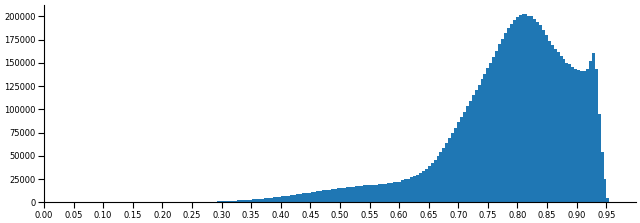
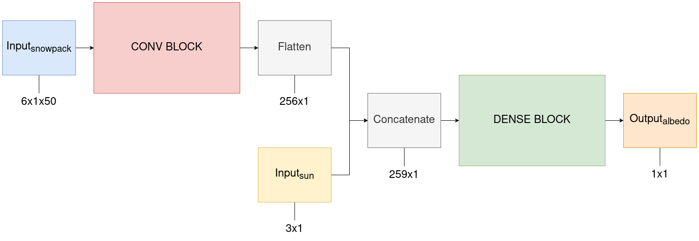
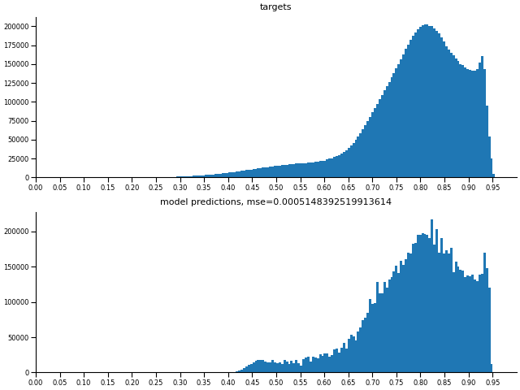
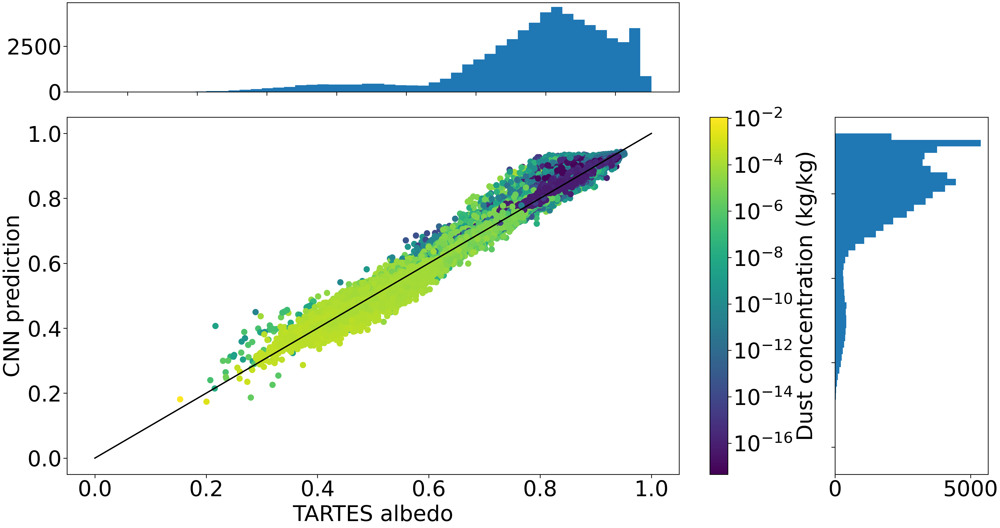
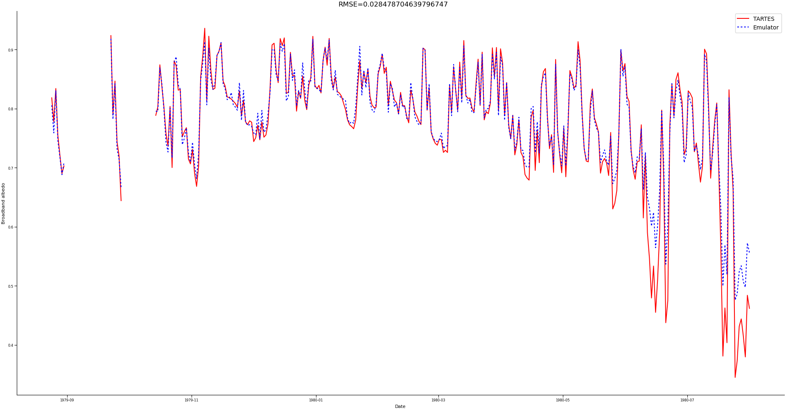
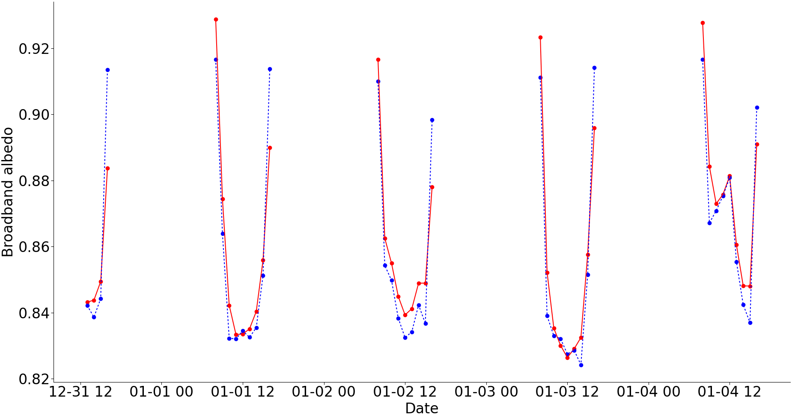
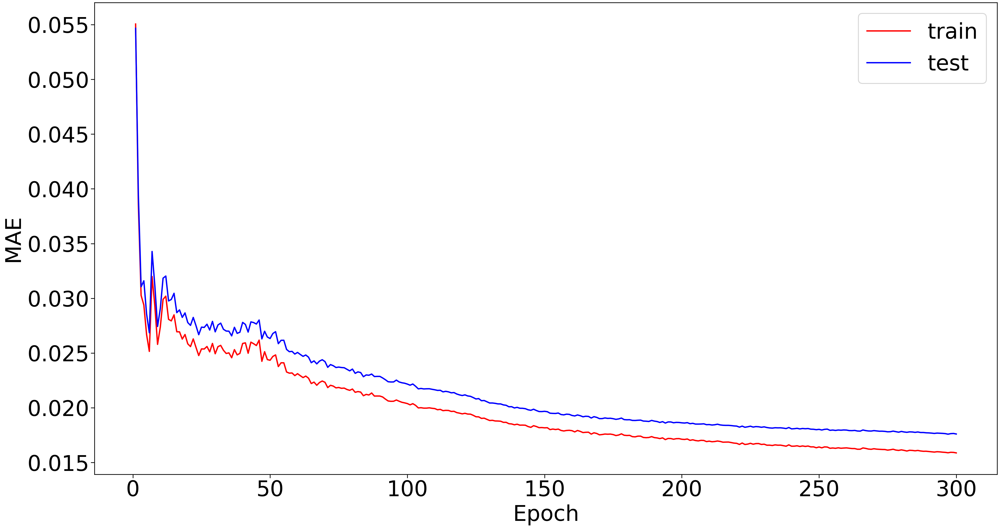
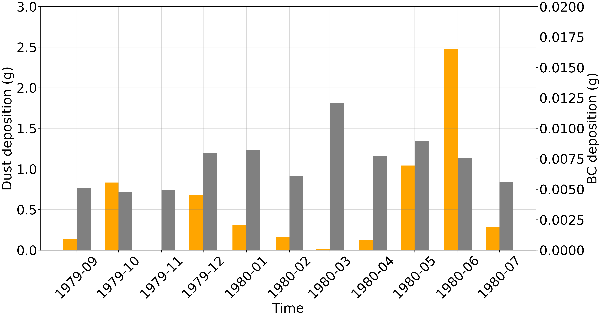

# TARTES-Emulator

Ce projet a pour but d'émuler le modèle optique TARTES (Two StreAm Radiative TransfEr in Snow), pour le calcul de l'albédo broadband, par des méthodes de deep learning. L'approche proposée est basée sur des réseaux de neurones convolutifs (CNN). Ce répertoire regroupe l'ensemble des codes permettant de reproduire les expériences, ainsi que des exemples de modèles déjà entrainés.

Auteur : A. Torrent \
Encadrement : M. Lafaysse, L. Viallon Galinier et M. Dumont

Le code est basé sur la bibliothèque PyTorch : [Documentation PyTorch](https://docs.pytorch.org/docs/stable/index.html).

## Le modèle TARTES

> [1] L. Charrois, E. Cosme, M. Dumont, M. Lafaysse, S. Morin, Q. Libois, and G. Pi-
card, “On the assimilation of optical reflectances and snow depth observations into a
detailed snowpack model," *The Cryosphere*, vol. 10, no. 3, pp. 1021, 1038, May 2016. https://doi.org/10.5194/tc-10-1021-2016 

> [2] G. Picard and Q. Libois, “Simulation of snow albedo and solar irradiance profile with the two-stream radiative transfer in snow (tartes) v2.0 model,” *The EGUsphere*, June 2024. https://doi.org/10.5194/gmd-17-8927-2024 

## Sommaire

- [Installation sur sxbigdata](#installation-de-l'environnement-sur-sxbigdata)
    - [Documentation](#documentation)
    - [Installation de miniconda](#installation-de-miniconda)
    - [Création de l'environnement Python](#création-de-lenvironnement)
    - [Installation de Snowtools](#installation-de-snowtools)
    - [Installation de Bronx](#installation-de-bronx)
    - [Quelques raccourcis personnels](#quelques-raccourcis-personnels)
    - [Et sur Belenos ?](#et-sur-belenos)
- [Les données](#les-données)
    - [Entrées et sorties](#entrées-et-sorties)
    - [Importer les fichiers depuis Hendrix](#importer-les-fichiers-netcdf-depuis-hendrix)
    - [Agencer les fichiers](#agencer-les-fichiers)
    - [Prétraitements](#prétraitements)
    - [Distribution des valeurs d'albédo](#distribution-des-valeurs-dalbédo)
- [Les modèles](#les-modèles)
    - [Architecture générale](#architecture-générale)
    - [Entrainement](#entrainement)
    - [Charger un modèle](#charger-un-modèle-déjà-entraîné)
- [Plots](#plots)
- [Aide](#aide)

## Installation de l'environnement sur sxbigdata

sxbigdata1 : 2 processeurs (10 coeurs), 376 gigas de mémoire, 3 cartes graphiques, 1 nvidia Tesla 100 (16 gigas, 5120 cuda cores) et 2 NVIDIA A30 (24 gigas, 3584 cuda cores).

sxbigdata10 : 1 processeur (8 coeurs), 64 gigas de mémoire, carte graphique nvidia 1080Ti (11 gigas, 3584 cuda cores). \
sxbigdata11 : En théorie identique à sxbigdata10.

### Documentation 

* [Club Deep Learning - Wiki sxbidata](http://confluence.meteo.fr/display/DeepLearning/Serveurs+sxbigdata)
* [LabIA - Créer un environnement Conda sur sxbigdata](http://confluence.meteo.fr/pages/viewpage.action?pageId=531434265)
* [SIRES - Présentation utilisateurs sxbigdata](http://intra.cnrm.meteo.fr/cti/doc/spip.php?article56)

### Installation de miniconda

1. Exécuter le binaire :
```
sh /home/logiciels_deep_learning/Miniconda3-24.7.1_Python-3.12.4_2024-08-22_Linux-x86_64.sh
```

2. Puis spécifier que l’installation doit être faite sous `/bigdata/BIGDATA/torrenta` ;

3. Accepter la modification de votre *.bashrc* ;

4. Lancer un nouveau terminal, ou exécuter `source ~/.bashrc`  pour prendre en compte l’installation de miniconda.

Si l’installation s’est bien déroulée, vous devriez voir *(base)* au début de la ligne de votre terminal.

### Création de l'environnement

Le fichier *requirements.txt* liste les dépendances nécessaires à l'exécution du code. Le site https://anaconda.org permet de savoir si les versions des librairies utilisées sont toujours d'actualité.

**Version de Python utilisée : 3.13.8**

1. Créer un fichier *.condarc* pour y définir quelques channels :
```
channels:
- conda-forge
- pytorch
- nvidia
report_errors: False
ssl_verify: True
show_channel_urls: true
repodata_threads: 2 
```

2. Définir le nom de l'environnement avec l’argument *-p* lors de votre *conda create* pour que l’environnement s’installe sur `/bigdata/BIGDATA/torrenta` et non pas sur `/home/torrenta` :
```
(base) sxbigdata1:/home/torrenta => conda create --file requirements.txt --prefix /bigdata/BIGDATA/torrenta/conda_envs/envA
```

3. Quitter l'environnement *base* et activer le nouvel environnement *envA* :
```
conda deactivate base
conda activate /bigdata/BIGDATA/torrenta/conda_envs/envA
```

Si l'installation s’est bien déroulée, vous devriez voir *(/bigdata/BIGDATA/torrenta/conda_envs/envA)* au début de la ligne de votre terminal.

### Installation de snowtools

Documentation : https://umr-cnrm.github.io/snowtools-doc/index.html \
Code : https://github.com/UMR-CNRM/snowtools

Suivre la documentation ci-dessus, ou utiliser la commande *put* si snowtools est déjà installé sur une autre machine.

### Installation de bronx

Code : https://github.com/UMR-CNRM/bronx

A l'heure actuelle, il n'est pas possible d'installer vortex sur sxbigdata. La librairie bronx comprise dans vortex est nécessaire au calcul de l'angle zénithal. Il faut donc l'installer séparement.

1. Télécharger le code : 
```
git clone https://github.com/UMR-CNRM/bronx
```

2. Puis dans le fichier *.profile* :
```
export BRONX=/home/torrenta/bronx/src
export PYTHONPATH=$PYTHONPATH:$BRONX
```

Lancer un nouveau terminal pour prendre en compte l'installation.

### Quelques raccourcis personnels

```
alias torrenta="cd /home/torrenta"
alias nosave="cd /cnrm/cen/users/NO_SAVE/torrenta"
alias bigdata="cd /bigdata/BIGDATA/torrenta"
alias envA="conda activate /bigdata/BIGDATA/torrenta/conda_envs/envA"
``` 

### Et sur Belenos

Dans le cas où l'utilisation de sxbigdata serait limitante, il est possible d'utiliser un noeud de Belenos dédié au deep learning (avec GPUs). La documentation est très complète, néanmoins je déconseille l'utilisation de conda, privilégiez PyPI (beaucoup plus rapide).

**La documentation :**
- http://diagnostix.meteo.fr/dokuwiki/lib/exe/fetch.php?media=cc:user:hpc:doc_utilisateur_belenos_taranis_v2.pdf
- http://confluence.meteo.fr/display/~marc.mandement@meteo.fr/Commandes+informatiques+utiles

```
# Version de Python
module load python/3.10.12
```

=> Installation des bibliothèques dans *~/.local/lib/python3.10*


Stockage sur le lustre (scratch) :
- Pas de quotas ;
- Ménage automatique sur le TMPDIR (/scratch/utmp) des fichiers supérieurs à 1 jour ;
- Ménage automatique sur le WORKDIR (/scratch/work) des fichiers supérieurs à 3 mois ;
- Pas de sauvegarde.


Pour exécuter un script python, il est nécessaire de passer par un l'intermédiaire d'un fichier tel que *launch.sbatch* :
```
#!/bin/bash
#SBATCH --job-name=my_job_name
#SBATCH --output=logs/output_%x.out
#SBATCH --error=logs/error_%x.err
#SBATCH --partition=ndl
#SBATCH --time=24:00:00
#SBATCH --gres=gpu:1
#SBATCH --mem=128G

srun python my_script.py
```

Pour suivre l'avancement de vos jobs :
```
squeue -u torrenta
```

Il est possible de se connecter en ssh au noeud de calcul, pour évaluer l'utilisation des GPUs.

## Les données

Le jeu de données est constitué d’entrées et sorties du modèle Crocus [3]. Les simulations ont été réalisées avec sa version 3.0, en activant le module de transfert radiatif TARTES [1, 2]. Ces simulations sont forcées par les réanalyses météorologiques SAFRAN [4] et des simulations des dépôts d’impuretés absorbantes du modèle ALADIN-Climat ajustées en altitude comme décrit par Réveillet et al. [5]. Il englobe les 23 massifs des Alpes françaises ainsi que 11 massifs des Pyrénées.

> [3] M. Lafaysse, M. Dumont, B. De Fleurian, R. Fructus, M.and Nheili, L. Viallon-Galinier, M. Baron, A. Boone, A. Bouchet, J. Brondex, C. Carmagnola, B. Cluzet, K. Fourteau, A. Haddjeri, P. Hagenmuller, G. Mazzotti, M. Minvielle, S. Morin, L. Quéno, L. Roussel, P. Spandre, F. Tuzet, and V. Vionnet, “Version 3.0 of the crocus snowpack model,” *EGUsphere [preprint]*, 2025. https://doi.org/10.5194/egusphere-2025-4540

> [4] M. Vernay, M. Lafaysse, D. Monteiro, P. Hagenmuller, R. Nheili, R. Samacoïts, D. Verfaillie, and S. Morin, “The s2m meteorological and snow cover reanalysis over the french mountainous areas : description and evaluation (1958–2021),” *Earth System Science Data*, vol. 14, 2022. https://doi.org/10.5194/essd-14-1707-2022

> [5] M. Réveillet, M. Dumont, S. Gascoin, M. Lafaysse, P. Nabat, A. Ribes, R. Nheili, F. Tuzet, M. Ménégoz, S. Morin, G. Picard, and P. Ginoux, “Black carbon and dust alter the response of mountain snow cover under climate change,” Nature Communications, vol. 13, p. 5279, 2022. https://doi.org/10.1038/s41467-022-32501-y

### Entrées et sorties

Les paramètres marqués d'un (ℓ) sont donnés pour chaque couche de neige.

| **Paramètres** | **Description** | **Unité** | **Dimensions** |
|:-------------- |:--------------- |:---------:|:--------------:|
| **Inputs** |
| Δz(ℓ) | Epaisseur de chaque couche de neige | m | (50, 1) | 
| SSA(ℓ) | Surface spécifique (Specific Surface Area)| m<sup>2</sup>.kg<sup>-1</sup> | (50, 1) |
| *ρ*(ℓ) | Densité | kg.m<sup>-3</sup> | (50, 1) |
| *c*<sub>soot</sub>(ℓ) | Concentration en suie (soot) | kg.kg<sup>-1</sup> | (50, 1) |
| *c*<sub>dust</sub>(ℓ) | Concentration en poussière (dust) | kg.kg<sup>-1</sup> | (50, 1) |
| SW<sub>direct</sub> | Rayonnements solaires directs | W.m<sup>-2</sup> | (1, 1) |
| SW<sub>diffuse</sub> | Rayonnements solaires diffus | W.m<sup>-2</sup> | (1, 1) |
| θ<sub>0</sub> | Angle zénithal solaire | degrés | (1, 1) |
| **Output** |
| α<sub>broadband</sub> | Albédo large bande (broadband albedo) | - | (1, 1) |

**Nombre de couches variables :**
La gestion du nombre de couche de neige dans Crocus est dynamique. Le nombre de couches est recalculé à chaque pas de temps, avec un maximum de 50. Cela implique que la taille des données d'entrée pour TARTES est variable. Pour répondre à cette problématique, les profils de neige sont représentés sous la forme de vecteurs de taille fixe (50), les couches absentes étant complétées par des valeurs nulles. En complément, un vecteur binaire de taille 50 est ajouté aux entrées du modèle, indiquant pour chaque niveau la présence ou l’absence effective d’une couche de neige.

**Manteau neigeux fins :**
Dans les situations de manteaux neigeux fins, la lumière peut pénétrer jusqu'au sol. Dans le but de guider le modèle, une variable scalaire est ajoutée aux données indiquant l'épaisseur totale du manteau neigeux. Cet ajout a été décidé après avoir constaté que le modèle surestimait les faibles valeurs d'albédo, également moins représentées dans le dataset.

| **Paramètres** | **Description** | **Unité** | **Dimensions** |
|:-------------- |:--------------- |:---------:|:--------------:|
| **+ 2 Inputs** |
| LP(ℓ) | Présence d'une couche de neige (Layer Presence) | - | (50, 1) |
| Δz<sub>total</sub> | Epaisseur totale du manteau neigeux | m | (1, 1) |

### Importer les fichiers netCDF depuis Hendrix

**IMPORTANT : Vortex n'est pas disponible depuis sxbigdata, se connecter à sxcen pour cette étape.**

Le lustre est accessible depuis sxcen et sxbigdata : `/cnrm/cen/users/NO_SAVE/torrenta`

Importer les fichiers dans le répertoire courant avec : 

```
python3 $SNOWTOOLS_CEN/snowtools/scripts/extract/vortex/get_reanalysis.py -b 19790801 -e 19800801 --meteo --snow --geometry='alp_allslopes' --xpid='Reveillet2022.crocus3.0@lafaysse'
```

*Options :* \
*-b, --begin, --byear: Date of begining of extraction (year of full date)* \
*-e, --end, --eyear: Date of end of extraction (year or full date)* \
*--meteo: Extract meteorological forcing files* \
*--snow: Extract snowpack model output files* \
*--geometry: Geometry* \
*--xpid: Experience ID*

Puis vider le cache de vortex : `/cnrm/cen/users/NO_SAVE/torrenta/cache/vortex`

### Agencer les fichiers

```
Alpes/
├── FORCING/
│   ├── FORCING_1979080106_1980080106.nc
│       ...
└── PRO/
    ├── PRO_1979080106_1980080106.nc
        ...

Pyrenees/
├── FORCING/
│   ├── FORCING_1979080106_1980080106.nc
│       ...
└── PRO/
    ├── PRO_1979080106_1980080106.nc
        ...
```

### Prétraitements

Le prétraitement, tel qu'il est construit, nécessite l'utilisation d'environ 85 Go de mémoire vive pendant plusieurs heures. Sur l'architecture sxbigdata, seulement la machine 1 possède les ressources nécessaires (376 Go de RAM). Les machines 10 et 11 ne possèdent que 64 Go de RAM. La commande *htop* fournit un aperçu rapide de la mémoire utilisée. 

Choisir l'emplacement où seront stockées les données prétraitées : `/bigdata/BIGDATA/torrenta`

```
torrenta/
├── Alpes/
└── Pyrenees/
```

Se placer dans : `/home/torrenta/TARTES-Emulator/preprocessing`

La commande *screen -dmS preprocessing* permet de créer un nouveau terminal détaché *preprocessing* qui ne s'arrêtera pas même si la connexion ssh avec sxbigdata1 venait à être coupée. Ce dernier se fermera automatiquement à la fin du prétraitement. Il est possible de voir si le terminal est encore ouvert avec la commande *screen -ls*.

Exécuter la commande :
```
screen -dmS preprocessing bash launch.sh
```

L'avancement du prétraitement est accessible via le fichier *monitoring.txt*.

### Distribution des valeurs d'albédo

*Figure : Distribution des valeurs d'albédo calculées par TARTES après les prétraitements*



## Les modèles

### Architecture générale



### Entrainement

Le script d'entrainement d'un modèle est écrit dans *main.py*.

Les grandes étapes sont :

1. Sélectionner les années d'entrainement (*utils/data_selection.py*).

2. Normaliser les données (*utils/mean_and_std.py* et *utils/norm.py*).

3. Créer un dataset (*dataset.py*) et son loader.

4. Choisir le modèle (*models.py*).

5. Sélectionner le GPU. Sur sxbigdata1,  *0* ou *1* pour une A30 et *2* pour une V100.

6. Choisir la loss, l'optimizer et le LR scheduler.

7. Boucler sur *N* epochs : entrainement, évaluation sur le jeu d'entrainement et évaluation sur le jeu de test (voir *training.py*)

8. Enregister les poids du modèle.

### Charger un modèle déjà entraîné

Le dossier *data/* regroupe quelques modèles déjà entraînés.

```
import torch 
from models import CnnTartesEmulator

model = CnnTartesEmulator()
weights_path = f"{dir}/model.pt"
model_state = torch.load(model_path, weights_only=True)["model_state"]
model.load_state_dict(model_state)
```

Voir la documentation [Saving and Loading Models](https://docs.pytorch.org/tutorials/beginner/saving_loading_models.html).

## Plots

Les scripts permettant de générer des graphiques sont regroupés dans le dossier *plot/*.

Ces scripts utilisent un dataset différent (*utils/dataframe_dataset.py*) permettant de sélectionner exactement les données souhaitées à l'aide d'un DataFrame Pandas. 

### Distribution de valeurs d'albédo prédites par le CNN (*distribution_albedo.py*)



### Valeurs prédites par le CNN en fonction des albédos calculés par TARTES (*scatter_plot.py*)



### Evolution de l'albédo à 12h sur l'ensemble de la saison (*profile_year.py*)



### Cycle diurne de l'albédo (*profile_days.py*)



### Evolution de l'erreur au cours de l'entrainement (*metric_evolution.py*)



### Dépots d'impuretés chaque mois (*LAI_depositions.py*)



## Aide

Pour toute question supplémentaire sur l'utilisation de ce code, n'hésitez pas à m'écrire à l'adresse adrien.tor@gmail.com.
