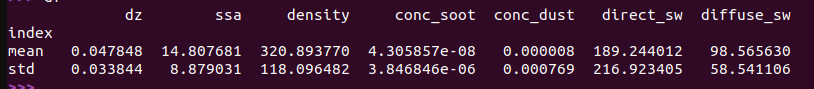

# TARTES-Emulator

*Présentation du projet*

## Le modèle TARTES

*TODO*

## Description du modèle

*Description générale*

### Entrées et sorties

Les paramètres marqués d'un (ℓ) sont donnés pour chaque couche de neige.

| **Paramètres** | **Description** | **Unité** | **Dimensions** |
|:-------------- |:--------------- |:---------:|:--------------:|
| **Inputs** |
| Δz(ℓ) | Epaisseur | m | (50, 1) | 
| SSA(ℓ) | Surface spécifique | m<sup>2</sup>.kg<sup>-1</sup> | (50, 1) |
| *ρ*(ℓ) | Densité | kg.m<sup>-3</sup> | (50, 1) |
| *c*<sub>soot</sub>(ℓ) | Concentration en suie | kg.kg<sup>-1</sup> | (50, 1) |
| *c*<sub>dust</sub>(ℓ) | Concentration en poussière | kg.kg<sup>-1</sup> | (50, 1) |
| SW<sub>direct</sub> | Rayonnements solaires directs | W.m<sup>-2</sup> | (1, 1) |
| SW<sub>diffuse</sub> | Rayonnements solaires diffus | W.m<sup>-2</sup> | (1, 1) |
| θ<sub>0</sub> | Angle zénithal solaire | degrés | (1, 1) |
| **Outputs** |
| α<sub>broadband</sub> | Albedo large bande | - | (1, 1) |
| α<sub>spectral</sub> | Albedo spectral | - | (111, 1) |

### Schéma

*Insérer un schéma*

### Résumé

*Couches, nombre de paramètres entrainables...*

### Performances

*MSE, graphiques...*

## Installation de l'environnement sur sxbigdata

### Documentation 

* [Club Deep Learning - Wiki sxbidata](http://confluence.meteo.fr/display/DeepLearning/Serveurs+sxbigdata)
* [LabIA - Créer un environnement Conda sur sxbigdata](http://confluence.meteo.fr/pages/viewpage.action?pageId=531434265)
* [SIRES - Présentation utilisateurs sxbigdata](http://intra.cnrm.meteo.fr/cti/doc/spip.php?article56)

### Installation de miniconda

1. Exécuter le binaire :
```
sh /home/logiciels_deep_learning/Miniconda3-24.7.1_Python-3.12.4_2024-08-22_Linux-x86_64.sh
```

2. Puis spécifier que l’installation doit être faite sous `/bigdata/BIGDATA/torrenta` ;

3. Accepter la modification de votre *.bashrc* ;

4. Lancer un nouveau terminal, ou exécuter `source ~/.bashrc`  pour prendre en compte l’installation de miniconda.

Si l’installation s’est bien déroulée, vous devriez voir *(base)* au début de la ligne de votre terminal.

### Création de l'environnement

Le fichier *requirements.txt* liste les dépendances nécessaires à l'exécution du code. Le site https://anaconda.org permet de savoir si les versions des librairies utilisées sont toujours d'actualité.

1. Créer un fichier *.condarc* pour y définir quelques channels :
```
channels:
- conda-forge
- pytorch
- nvidia
report_errors: False
ssl_verify: True
show_channel_urls: true
repodata_threads: 2 
```

2. Définir le nom de l'environnement avec l’argument *-p* lors de votre *conda create* pour que l’environnement s’installe sur `/bigdata/BIGDATA/torrenta` et non pas sur `/home/torrenta` :
```
(base) sxbigdata1:/home/torrenta => conda create --file requirements.txt --prefix /bigdata/BIGDATA/torrenta/conda_envs/envA
```

3. Quitter l'environnement *base* et activer le nouvel environnement *envA* :
```
conda deactivate base
conda activate /bigdata/BIGDATA/torrenta/conda_envs/envA
```

Si l'installation s’est bien déroulée, vous devriez voir *(/bigdata/BIGDATA/torrenta/conda_envs/envA)* au début de la ligne de votre terminal.

### Installation de snowtools

Documentation : https://umr-cnrm.github.io/snowtools-doc/index.html \
Code : https://github.com/UMR-CNRM/snowtools

Suivre la documentation ci-dessus, ou utiliser la commande *put* si snowtools est déjà installé sur une autre machine.

### Installation de bronx

Code : https://github.com/UMR-CNRM/bronx

A l'heure actuelle, il n'est pas possible d'installer vortex sur sxbigdata. La librairie bronx comprise dans vortex est nécessaire au calcul de l'angle zénithal. Il faut donc l'installer séparement.

1. Télécharger le code : 
```
git clone https://github.com/UMR-CNRM/bronx
```

2. Dans le fichier *.profile* :
```
export BRONX=/home/torrenta/bronx/src
export PYTHONPATH=$PYTHONPATH:$BRONX
```

Lancer un nouveau terminal pour prendre en compte l'installation.

### Quelques raccourcis

Ajouter au *.bashrc* les alias suivants :
```
alias torrenta="cd /home/torrenta"
alias nosave="cd /cnrm/cen/users/NO_SAVE/torrenta"
alias bigdata="cd /bigdata/BIGDATA/torrenta"
alias envA="conda activate /bigdata/BIGDATA/torrenta/conda_envs/envA"
``` 

## Prétraitement des données

Le prétraitement, tel qu'il est construit, nécessite l'utilisation d'environ 85 Go de mémoire vive pendant plusieurs heures. Sur l'architecture sxbigdata, seulement la machine 1 possède les ressources nécessaires (376 Go de RAM). Les machines 10 et 11 ne possèdent que 64 Go de RAM. La commande *htop* fournit un aperçu rapide de la mémoire utilisée. 

### Importer les fichiers netCDF depuis Hendrix

**IMPORTANT : Vortex n'est pas disponible depuis sxbigdata, se connecter à sxcen pour cette étape.**

Le lustre est accessible depuis sxcen et sxbigdata : `/cnrm/cen/users/NO_SAVE/torrenta`

Importer les fichiers dans le répertoire courant avec : 

```
python3 $SNOWTOOLS_CEN/snowtools/scripts/extract/vortex/get_reanalysis.py -b 19790801 -e 19800801 --meteo --snow --geometry='alp_allslopes' --xpid='Reveillet2022.crocus3.0@lafaysse'
```

*Options :* \
*-b, --begin, --byear: Date of begining of extraction (year of full date)* \
*-e, --end, --eyear: Date of end of extraction (year or full date)* \
*--meteo: Extract meteorological forcing files* \
*--snow: Extract snowpack model output files* \
*--geometry: Geometry* \
*--xpid: Experience ID*

Puis vider le cache de vortex : `/cnrm/cen/users/NO_SAVE/torrenta/cache/vortex`

### Agencer les fichiers

```
Alpes/
├── FORCING/
│   ├── FORCING_1979080106_1980080106.nc
│       ...
└── PRO/
    ├── PRO_1979080106_1980080106.nc
        ...

Pyrenees/
├── FORCING/
│   ├── FORCING_1979080106_1980080106.nc
│       ...
└── PRO/
    ├── PRO_1979080106_1980080106.nc
        ...
```

### Stocker les données prétraitées

Choisir l'emplacement où seront stockées les données prétraitées : `/bigdata/BIGDATA/torrenta`

```
torrenta/
├── Alpes/
└── Pyrenees/
```

### Exécuter le prétraitement

Se placer dans : `/home/torrenta/TARTES-Emulator/scripts/preprocessing`

La commande *screen -dmS preprocessing* permet de créer un nouveau terminal détaché *preprocessing* qui ne s'arrêtera pas même si la connexion ssh avec sxbigdata1 venait à être coupée. Ce dernier se fermera automatiquement à la fin du prétraitement. Il est possible de voir si le terminal est encore ouvert avec la commande *screen -ls*.

Exécuter la commande :
```
screen -dmS preprocessing bash launch.sh
```

L'avancement du prétraitement est accessible via le fichier *monitoring.txt*. Pour un jeu de données de 10 ans, sur les Alpes et les Pyrénées, cela doit durer environ 12h.

### Calculer la moyenne et l'écart-type du jeu de données

Se placer dans : `/home/torrenta/TARTES-Emulator/scripts/normalization`

Exécuter la commande :
```
python3 normalization/get_mean_and_std.py
```

*Temps d'exécution : 4145.48 s*

La moyenne et l'écart-type de chaque paramètre seront enregistrés dans `data/normalization/mean_and_std.parquet`.



## Entrainement du modèle

*TODO*

## Utiliser le modèle

*TODO*
